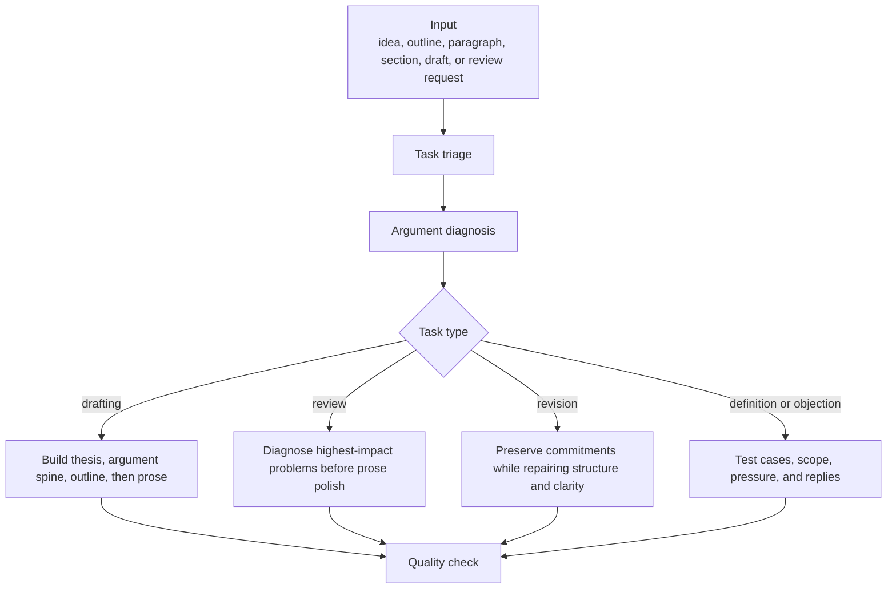

# Philosophy Writing Skill

`philosophy-writing` is a general Codex skill for drafting, reviewing, revising, outlining, and analyzing philosophical prose. It guides Codex toward thesis-first, argument-driven writing: clear claims, explicit premises, stable definitions, charitable engagement, serious objections, direct replies, and concrete prose revision.

The repository is intentionally project-neutral. It does not contain private research context, personal file paths, project structure, unpublished arguments, or project-specific claims.

## What This Skill Is For

Use `philosophy-writing` when you want Codex to help with:

- sharpening a thesis statement;
- turning an idea into an argument outline;
- drafting philosophy prose;
- reviewing a paragraph, section, essay, proposal, article, or long-form project;
- revising prose for clarity, precision, and argumentative force;
- reconstructing an argument in premise-conclusion form;
- testing a definition against central cases, edge cases, and counterexamples;
- developing objections and replies;
- making literature review prose dialectical rather than merely descriptive;
- identifying unsupported premises, weak transitions, vague terms, and overclaims.

The skill is not a private project manager. It should not silently update files, promote exploratory ideas into settled claims, or export private material.

## Installation

Clone the repository into your Codex skills folder:

```bash
git clone https://github.com/Aaronlves/philosophy-writing-skill.git ~/.codex/skills/philosophy-writing
```

If you already have a local copy, update it with:

```bash
cd ~/.codex/skills/philosophy-writing
git pull
```

The skill folder should contain:

```text
philosophy-writing/
├── SKILL.md
├── README.md
└── agents/
    └── openai.yaml
```

## Basic Usage

Ask Codex to use `philosophy-writing` and provide the relevant prose, outline, notes, argument sketch, or revision goal.

Examples:

```text
Use philosophy-writing to review this draft for thesis clarity, argument structure, objections, and prose.
```

```text
Use philosophy-writing to turn this idea into a modest, defensible philosophy paper thesis and outline.
```

```text
Use philosophy-writing to test this definition against central cases, edge cases, and possible counterexamples.
```

```text
Use philosophy-writing to turn this literature review into an argument-driven section that classifies each source by its role.
```

```text
Use philosophy-writing to revise this paragraph so it is clearer, more precise, and more directly connected to the thesis.
```

## Workflow Overview

The skill follows a staged workflow:



## Step 1: Triage the Writing Task

Before drafting, reviewing, or revising, Codex should identify:

- genre: essay, article, proposal, section, paragraph, literature review, objection/reply, outline, or draft review;
- audience: instructor, specialist, general philosopher, peer reviewer, or self-facing draft;
- stage: brainstorming, outline, rough draft, revision, polish, or final check;
- local thesis or target claim;
- larger project thesis, if supplied;
- section function;
- argument status;
- definition status;
- source constraints;
- citation style;
- file-update permission;
- privacy boundary.

If some information is missing, Codex should proceed with reasonable assumptions and state any assumption that materially affects the output.

## Step 2: Classify the Mode

The skill uses the narrowest mode that satisfies the request:

| Mode | Use when |
| --- | --- |
| `outline-only` | The user needs structure before prose. |
| `argument-outline` | The user needs premises, conclusion, and inferential path. |
| `section-plan` | The user needs a section's function, order, and transitions. |
| `prose-draft` | The user wants new prose. |
| `paragraph-revision` | The user wants one paragraph improved. |
| `sentence-level-polish` | The argument is stable and only style needs work. |
| `argument-repair` | The argument has a gap, weak premise, or invalid inference. |
| `objection-and-reply` | The user needs serious pressure and a response. |
| `literature review prose` | Sources must be organized by argumentative role. |
| `draft-review` | The user wants diagnosis and revision priorities. |
| `revision-plan` | The user needs a sequence of changes before rewriting. |

Default behavior:

- For drafting, outline first unless the user explicitly asks for prose immediately.
- For review, diagnose the highest-impact philosophical problems before sentence-level issues.
- For revision, preserve the author's commitments unless the user asks for substantive reconstruction.
- For file edits, proceed only when the user authorizes editing.

## Step 3: Build the Thesis

A good philosophy thesis should be:

- explicit;
- contestable;
- specific;
- modest enough to defend;
- connected to a reason;
- clear about its scope.

Weak thesis:

```text
This paper is about lying.
```

Stronger thesis:

```text
I argue that lying and misleading differ morally because lying normally involves an assertion that the speaker believes to be false.
```

When the thesis is too broad, Codex should narrow it. When it is merely a topic, Codex should convert it into a claim.

## Step 4: Build the Argument Spine

Before drafting substantial prose, Codex should identify:

- target conclusion;
- main premises;
- suppressed premises;
- inferential links;
- examples or cases;
- likely objections;
- replies;
- remaining pressure points.

The prose should follow the argument. Background, exposition, and literature review should be included only when they help state the problem, defend a premise, motivate the view, sharpen an objection, or clarify the contribution.

## Step 5: Draft the Prose

When drafting, Codex should:

1. state the thesis early;
2. give a roadmap when length warrants it;
3. define technical terms on first use;
4. present arguments explicitly;
5. support each important premise;
6. use examples for abstract claims;
7. raise at least one serious objection when appropriate;
8. answer the objection directly;
9. keep transitions argumentative, not merely decorative;
10. avoid introducing new arguments in the conclusion.

For short assignments, the introduction should usually be terse: problem, thesis, roadmap.

## Step 6: Review the Draft

When reviewing existing prose, Codex should prioritize:

1. thesis clarity;
2. section function;
3. argument structure;
4. premise support;
5. definition stability;
6. objection and reply quality;
7. source use;
8. paragraph order;
9. transitions;
10. sentence-level clarity.

A review should not merely summarize or praise. It should identify concrete problems and provide concrete fixes.

## Step 7: Repair Arguments

When an argument is weak, Codex should locate the failure:

- Is the conclusion unclear?
- Is a premise missing?
- Is a premise unsupported?
- Is an inference invalid?
- Is a term shifting meaning?
- Is the example doing more work than it can support?
- Is the objection stronger than the reply?
- Would narrowing the thesis solve the problem?

Repair should preserve the user's philosophical commitments unless the user asks for a more substantive reconstruction.

## Step 8: Test Definitions

When a thesis depends on a definition, Codex should check:

- whether the definition is explicit;
- whether it is necessary, sufficient, biconditional, stipulative, or provisional;
- whether each term does real work;
- whether the definition handles central cases;
- whether it handles edge cases and counterexamples;
- whether it shifts during the argument;
- whether changing the definition requires revising the surrounding argument.

If a prose revision changes the meaning, scope, contrast class, or argumentative function of a load-bearing term, Codex should flag the philosophical risk rather than silently polish the sentence.

## Step 9: Handle Objections and Replies

For each objection, Codex should identify:

- the target: thesis, premise, inference, definition, example, scope condition, or method;
- the strongest version of the objection;
- why it matters;
- what should be conceded;
- what the reply is;
- what pressure remains.

Do not answer an objection by restating the thesis. A good reply explains which premise, assumption, inference, or scope condition in the objection fails.

## Step 10: Write Literature Review Prose

Literature review prose should be dialectical. It should classify sources by role:

- background source;
- opponent;
- precursor;
- partial ally;
- objection source;
- conceptual resource;
- methodological model;
- case source.

For each source, Codex should explain why it matters for the thesis. Avoid neutral author catalogues and avoid claiming that a source supports more than it actually supports.

## Step 11: Revise in Passes

Revision should normally proceed in this order:

1. thesis and scope;
2. argument spine;
3. definitions and distinctions;
4. objections and replies;
5. section order;
6. paragraph function;
7. transitions;
8. sentence clarity;
9. citations and quotations.

Do not begin with sentence-level polish when the argument is unstable.

## Output Templates

### Drafting output

```text
Task mode:
Assumptions:
Working thesis:
Argument spine:
Outline:
Draft prose:
Unresolved issues:
Suggested next revision:
```

### Review output

```text
Overall diagnosis:
Highest-impact issue:
Thesis issue:
Argument issue:
Structure issue:
Definition issue:
Objection/reply issue:
Literature issue:
Prose issue:
Concrete fixes:
Suggested revision order:
```

### Revision output

```text
Revision goal:
What was preserved:
What changed:
Revised prose:
Why the revision helps:
Remaining philosophical risks:
Further revision needed:
```

### Argument repair output

```text
Target conclusion:
Current argument:
Main weakness:
Repaired premise set:
Repaired inference:
Objection to repaired version:
Reply:
Remaining pressure:
```

### Objection-and-reply output

```text
Target:
Objection:
Why it matters:
Concession:
Reply:
Residual pressure:
Effect on thesis:
```

### Literature review prose output

```text
Local function:
Source roles:
Dialectical order:
Draft prose:
What each source does:
What not to overclaim:
Citation tasks:
```

## Style Rules

Codex should:

- use plain philosophical prose;
- prefer short, direct sentences;
- keep vocabulary stable;
- define central terms;
- use examples for abstract claims;
- distinguish the author's view from opponents' views;
- avoid grand openings and historical filler;
- avoid using citations as arguments from authority;
- use measured evaluative language;
- mark uncertainty rather than hiding it.

Common problems to flag:

- thesis appears late or is only a topic;
- roadmap is missing or vague;
- section has no clear function;
- too much exposition and too little argument;
- paragraph does not serve the central argument;
- objection is raised but not answered;
- opponent is straw-manned;
- key term is undefined;
- definition is not tested against cases;
- literature review becomes a neutral survey;
- source is cited for more than it supports;
- "therefore" or "thus" marks a weak inference;
- "I believe" is used as support.

## Citation and Source Discipline

Use the citation style specified by the user, department, journal, or target venue. If no style is specified, default to APA 7.

General rules:

- cite paraphrases and borrowed distinctions;
- cite direct quotations with page or location information when available;
- do not invent quotations, page numbers, DOI values, editions, or bibliographic metadata;
- verify citation-processor output before relying on it;
- use primary texts and professionally curated scholarly sources when possible;
- treat reference works as orientation, not substitutes for engagement with the arguments.

## File Updates

The default mode is advisory. Codex should not edit files unless the user authorizes file edits.

When file edits are authorized, report:

```text
Files changed:
Sections changed:
What was preserved:
What changed:
Philosophical risk:
Follow-up needed:
```

## Private Extensions

For a full research workflow, keep this public skill general and create a separate private extension. The extension should supply local project context, preferred terms, file paths, templates, and write permissions.

Recommended layout:

```text
project-philosophy-writing/
├── SKILL.md
├── agents/
│   └── openai.yaml
└── references/
    ├── project-context.md
    ├── writing-templates.md
    └── workspace-policy.md
```

Use this prompt to create one:

```text
Build a private project-specific extension for the installed
`philosophy-writing` skill. Do not copy or rewrite the general philosophy
writing standards. The extension must use `philosophy-writing` for thesis-first
drafting, argument repair, definition testing, objection/reply development,
literature review prose, and revision standards, then add only my local project
context and workflow rules.

Create the extension as a separate skill named `[project-name]-philosophy-writing`
in `[private skill directory]`. Keep it outside any public repository.

Include:

- the project question, thesis, and stable commitments;
- tentative hypotheses and open questions, clearly separated from stable claims;
- preferred terms, definitions, and distinctions;
- section or part functions, if relevant;
- writing templates and output formats;
- citation style and evidence rules;
- paths and naming conventions for private files;
- rules for when Codex may read, create, or update project files;
- privacy boundaries and material that must not be exported, searched, or published.

Design requirements:

1. Keep general philosophy-writing standards in `philosophy-writing`; do not
   duplicate them.
2. Make the extension trigger only when prose is being drafted, reviewed, or
   revised for this specific project.
3. Tell the agent to use both skills together: the extension supplies local
   project context, and `philosophy-writing` supplies the general method.
4. Treat project notes as context, not as independent scholarly evidence.
5. Preserve existing project files and conventions.
6. Do not create or update shared files unless the write policy authorizes it.
7. Put long project context in clearly named reference files and keep `SKILL.md`
   concise, with explicit instructions about when each reference must be read.
8. Include `agents/openai.yaml`, validate the finished skill, and report its
   private installation path and file structure.
9. Review the completed extension for personal or sensitive information before
   any publication. Default to keeping the entire extension private.

After creating it, show me a brief boundary audit: what remains in the general
skill, what lives in the private extension, and whether project-specific or
personal information appears outside the private directory.
```

## Repository Contents

```text
SKILL.md
agents/openai.yaml
README.md
```

## Repository

GitHub: <https://github.com/Aaronlves/philosophy-writing-skill>
